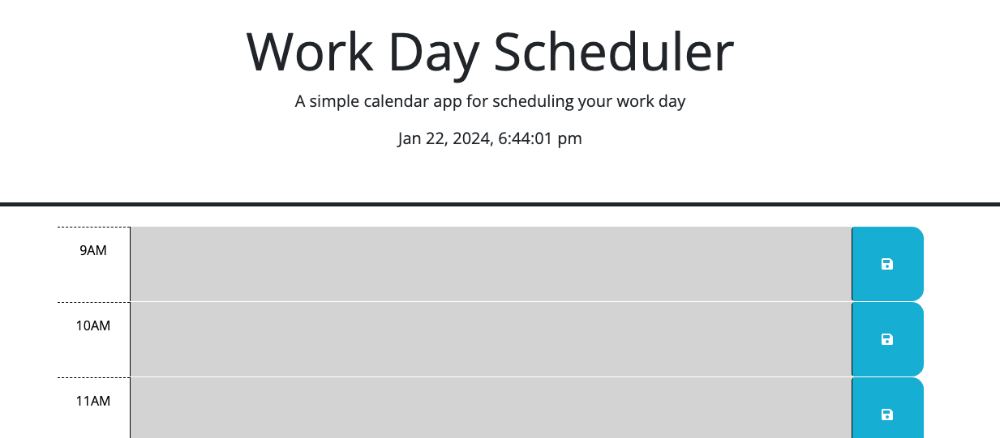

# Challenge Name

Calendar-Scheduler

## Description

This project was a Calendar Scheduler that someone can use for their work life. This helps them keep track of the time during the day as well as any meetings or important information that will help them throughout the work day. This solves the problem of being late or forgetting a meeting during the day that is important. The color blocks help espeically to keep track of time without having to reference a clock constantly.

## Usage

[Work-Day-Calendar](https://aejantz2015.github.io/calendar-scheduler/)

## Credits

Tutoring from Phillip Loy

## License

MIT License

Copyright (c) 2024 aejantz2015

Permission is hereby granted, free of charge, to any person obtaining a copy
of this software and associated documentation files (the "Software"), to deal
in the Software without restriction, including without limitation the rights
to use, copy, modify, merge, publish, distribute, sublicense, and/or sell
copies of the Software, and to permit persons to whom the Software is
furnished to do so, subject to the following conditions:

The above copyright notice and this permission notice shall be included in all
copies or substantial portions of the Software.

THE SOFTWARE IS PROVIDED "AS IS", WITHOUT WARRANTY OF ANY KIND, EXPRESS OR
IMPLIED, INCLUDING BUT NOT LIMITED TO THE WARRANTIES OF MERCHANTABILITY,
FITNESS FOR A PARTICULAR PURPOSE AND NONINFRINGEMENT. IN NO EVENT SHALL THE
AUTHORS OR COPYRIGHT HOLDERS BE LIABLE FOR ANY CLAIM, DAMAGES OR OTHER
LIABILITY, WHETHER IN AN ACTION OF CONTRACT, TORT OR OTHERWISE, ARISING FROM,
OUT OF OR IN CONNECTION WITH THE SOFTWARE OR THE USE OR OTHER DEALINGS IN THE
SOFTWARE.